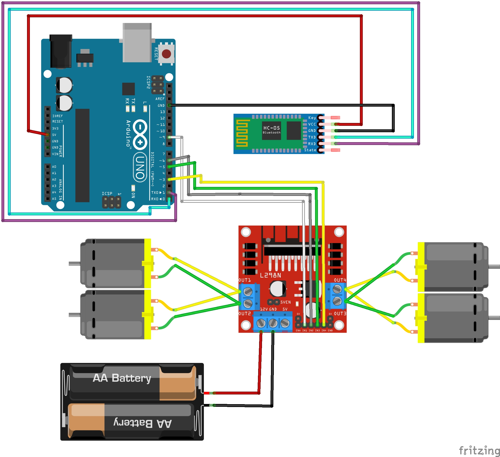

# Bluetooth Controlled SmartCar

This version of the SmartCar is designed to be controlled remotely using a Bluetooth-enabled device, such as a smartphone.

## How It Works

The car is equipped with an HC-05 or HC-06 Bluetooth module, which acts as a serial receiver. A smartphone with a Bluetooth Serial Terminal application can connect to the module and send single-character commands to control the car's movements.

### Control Commands:
* `F` - Move Forward
* `B` - Move Backward
* `L` - Turn Left
* `R` - Turn Right
* `S` - Stop

## Hardware Required

* Arduino Uno (or a compatible board)
* Motor Driver (H-Bridge)
* Car Chassis with 4x DC Motors and wheels
* HC-05 or HC-06 Bluetooth Module
* Jumper Wires
* Power Source

## Setup and Wiring

Below is a image for the circuit diagram and a list of the main pin connections.

  

### Key Pin Connections:
* **Motor Driver:**
    * `IN1`, `IN2`, `IN3`, `IN4` to Arduino digital pins.
* **Bluetooth Module (HC-05/HC-06):**
    * `VCC` to 5V
    * `GND` to GND
    * `TXD` to Arduino `RX` pin (e.g., Pin 0).
    * `RXD` to Arduino `TX` pin (e.g., Pin 1).

## How to Use

1. Assemble the circuit according to the diagram.
2. Open the `SmartCar_bluetooth.ino` file in the Arduino IDE.
3. Compile and upload the code to your Arduino board.
4. On your smartphone, search for and pair with the HC-05/HC-06 Bluetooth module (password is usually `1234` or `0000`).
5. Open a Bluetooth control app. While any generic Bluetooth Serial Terminal will work, I recommend using **"Arduino Bluetooth Robot Car"** (available on the Play Store) for its user-friendly interface.
6. Connect to the paired module within the app.
7. Send the commands to control the car.

## Contributors

* **Bernardo Thomas Bennemann** - *Project Owner* - [BBennemann](https://github.com/BBennemann)
